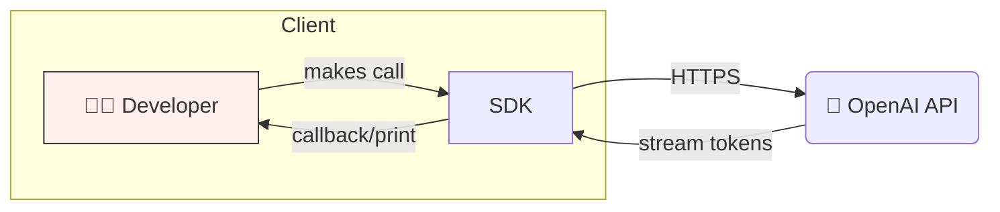

<!-- README.md – OpenAI SDK Samples xxx -->

<h1 align="center">
  🚀 OpenAI SDK Samples
</h1>

<p align="center">
  <em>Your hands-on playground for mastering the OpenAI API & SDK.</em>
</p>

<p align="center">
  <a href="https://platform.openai.com/">
    
  </a>
  <a href="LICENSE">
    
  </a>
  
</p>

---

## ✨ Why This Repo?

Whether you are building chat-bots, summarisation tools, or data-driven apps, this repository gives you **bite-sized, production-ready examples** for:

1. **Basic API Calls** – the fundamentals of requesting completions and embeddings.
2. **Structured Outputs** – harnessing `function_call` and JSON mode to get predictable data.
3. **Streaming Responses** – building snappy UIs by processing tokens on the fly.
4. **Built-in Tracing** – observability with `openai` SDK’s built-in tracing capabilities.

> 💡 **Tip:** Clone the repo, copy-paste snippets into your project, and iterate!

---

## 📂 Directory Layout

```text
openai-sdk-samples/
├─ .env.example            # Copy → .env and add your OPENAI_API_KEY
├─ README.md               # You are here!
├─ demos/                  # Ready-to-run demo scripts
│  ├─ basic_completion.py  # Hello, GPT-4o 🌟
│  ├─ structured_output.ts # JSON mode example (Node.js)
│  └─ streaming_chat.py    # Real-time token stream
├─ trainings/              # <-- Put your own training notebooks & docs here
│  └─ (your-content)/
└─ docs/                   # Extra docs & architecture diagrams
```

Feel free to add your **Jupyter notebooks, Markdown tutorials, or slide decks** inside `trainings/` – your sandbox for experimentation!

---

## ⚡ Quick Start

```bash
# 1. Clone the repo
$ git clone https://github.com/ozgurgulerx/openai-sdk-samples.git
$ cd openai-sdk-samples

# 2. Install dependencies (Python example)
$ pip install -r requirements.txt

# 3. Configure your environment
$ cp .env.example .env      # Add your OPENAI_API_KEY

# 4. Run your first sample 🎉
$ python demos/basic_completion.py
```

Need Node.js instead? Check out `demos/structured_output.ts` and run `npm install` first.

---

## 🖼️ Visual Overview



*Mermaid diagram showing how your code talks to the OpenAI API and streams tokens back to you.*

---

## 🧩 Feature Showcase

| Folder / File | What You’ll Learn |
| ------------- | ----------------- |
| `demos/basic_completion.py` | Minimal text generation request |
| `demos/structured_output.ts` | JSON mode + function calls |
| `demos/streaming_chat.py` | Managing streaming tokens |
| `docs/tracing.md` | Setting up tracing dashboards |

---

## 🛠️ Contributing

Got a cool snippet? Found a bug? **PRs are welcome!** Please open an issue first if it’s a large change.

---

## 📝 License

This project is licensed under the **MIT License** – see the [LICENSE](LICENSE) file for details.

---

<p align="center">
  Built with ❤️ & GPT-4o
</p>
